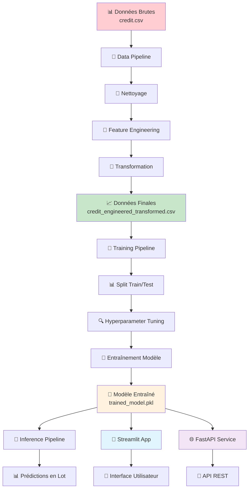
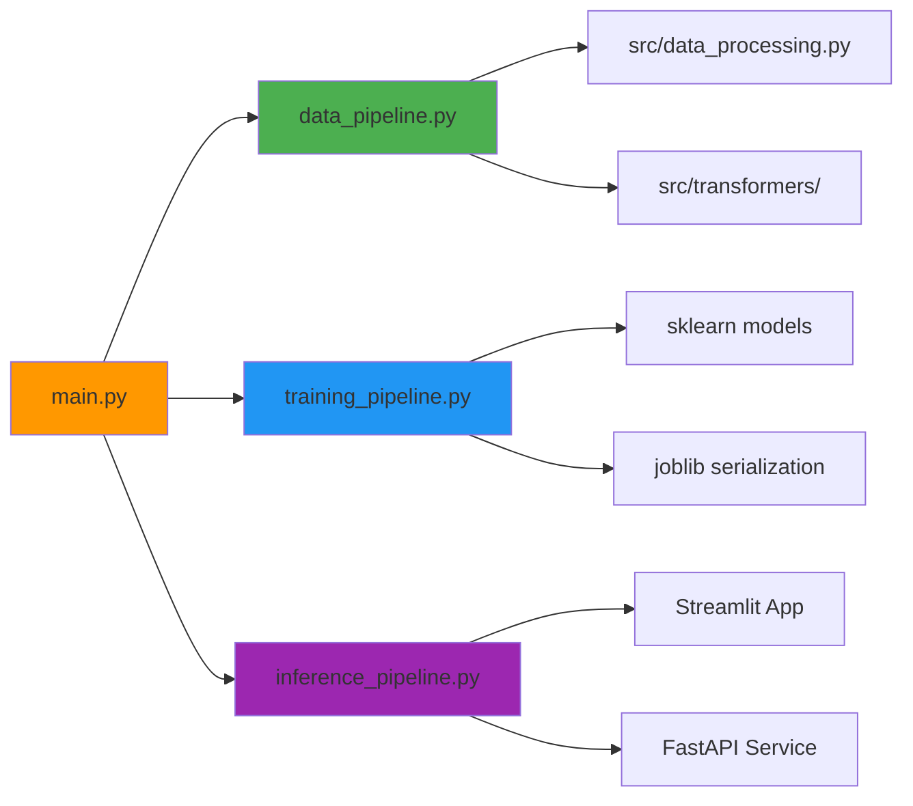
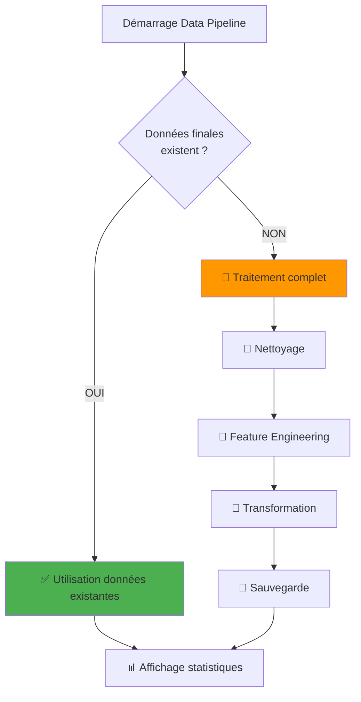
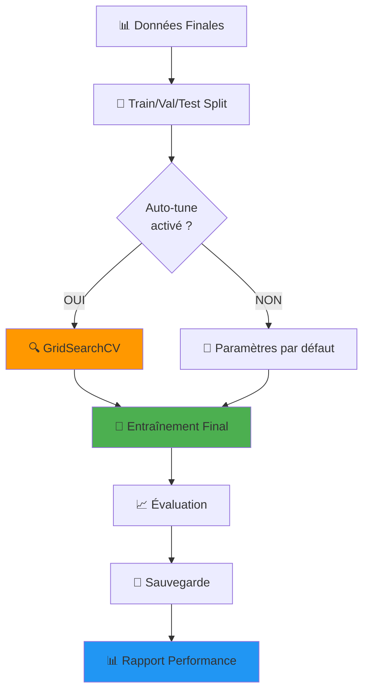
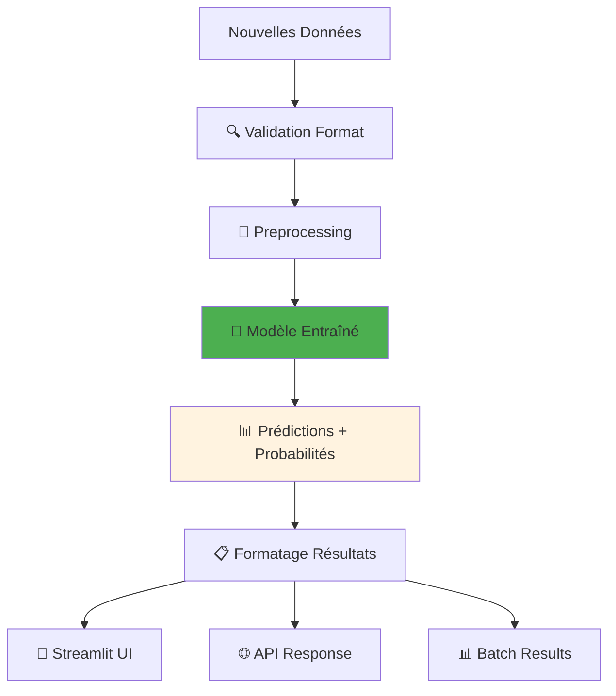
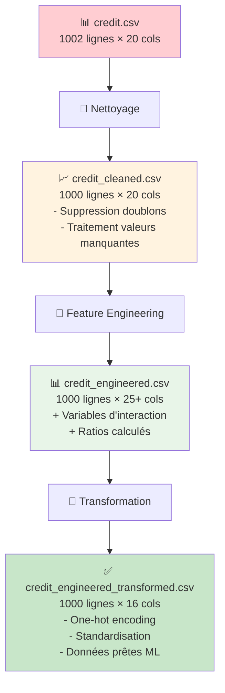
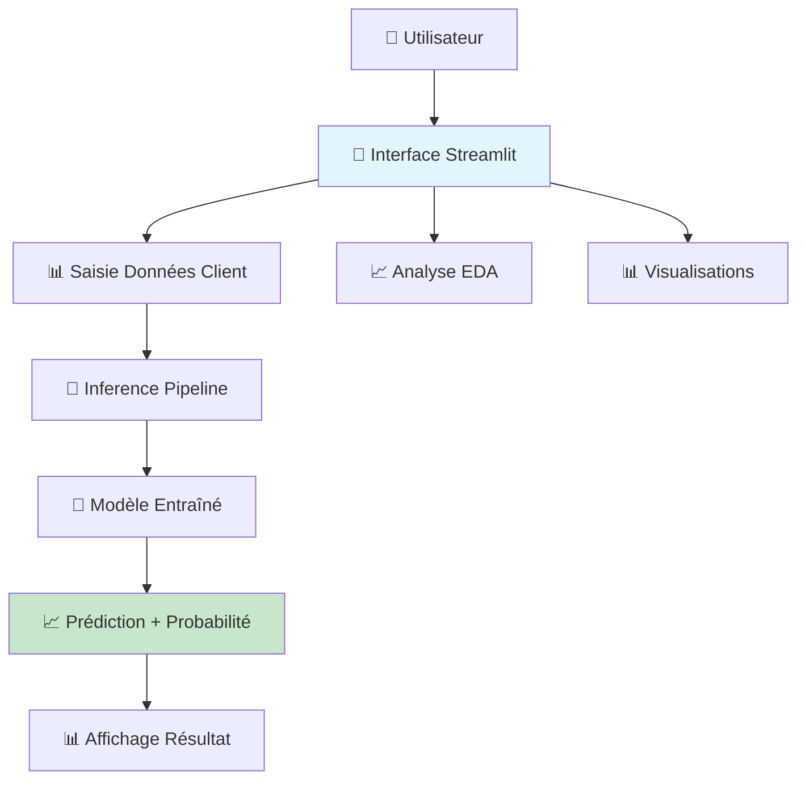
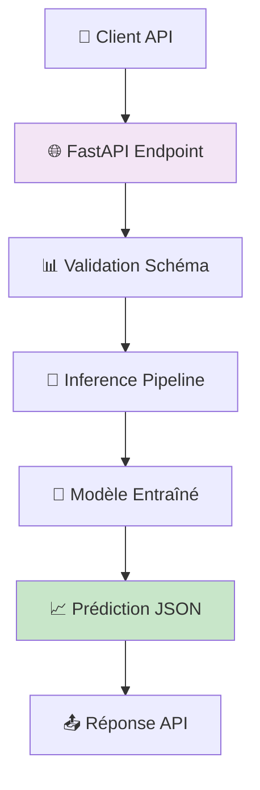
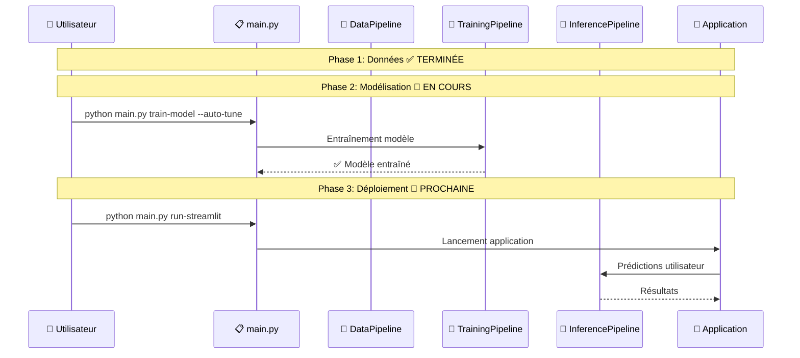

# 📚 DOCUMENTATION COMPLÈTE - PIPELINES & MODÉLISATION

## 🎯 SYSTÈME DE CREDIT SCORING - PHASE MODÉLISATION

**Date de création :** 2024  
**Version :** 1.0  
**Auteur :** Credit Scoring Team  
**Phase :** MODÉLISATION (Étape 2)

---

## 📋 TABLE DES MATIÈRES

1. [🏗️ Architecture Générale](#architecture-générale)
2. [🔄 Workflow Complet avec Schémas](#workflow-complet-avec-schémas)
3. [📁 Structure des Pipelines](#structure-des-pipelines)
4. [🔍 Détail des Pipelines](#détail-des-pipelines)
5. [📊 Flux de Données](#flux-de-données)
6. [🚀 Applications](#applications)
7. [🔧 Commandes Utilisateur](#commandes-utilisateur)

---

## 🏗️ ARCHITECTURE GÉNÉRALE

### 📊 Vue d'ensemble du système

```
┌─────────────────────────────────────────────────────────────────┐
│                    SYSTÈME CREDIT SCORING                       │
├─────────────────────────────────────────────────────────────────┤
│  📁 DATA LAYER                                                 │
│  ├── raw/credit.csv (données brutes)                           │
│  ├── processed/credit_cleaned.csv (nettoyées)                  │
│  ├── processed/credit_engineered.csv (features)                │
│  └── processed/credit_engineered_transformed.csv (finales)     │
│                                                                 │
│  🔄 PIPELINE LAYER                                              │
│  ├── data_pipeline.py (orchestrateur données)                  │
│  ├── training_pipeline.py (entraînement ML)                    │
│  └── inference_pipeline.py (prédictions)                       │
│                                                                 │
│  🤖 MODEL LAYER                                                 │
│  ├── models/trained_model.pkl (modèle entraîné)                │
│  ├── models/model_info.json (métadonnées)                      │
│  └── models/performance_metrics.json (métriques)               │
│                                                                 │
│  🖥️ APPLICATION LAYER                                           │
│  ├── Streamlit App (interface utilisateur)                     │
│  ├── FastAPI Service (API REST)                                │
│  └── main.py (orchestrateur CLI)                               │
└─────────────────────────────────────────────────────────────────┘
```

---

## 🔄 WORKFLOW COMPLET AVEC SCHÉMAS

### 📈 Diagramme de flux principal



### 📝 Explication du flux :

1. **📊 Données Brutes** → **🔄 Data Pipeline** ✅ **TERMINÉ**
   - Chargement du fichier `credit.csv`
   - Passage par les 3 étapes de preprocessing

2. **📈 Données Finales** → **🎯 Training Pipeline** 🎯 **EN COURS**
   - Split des données d'entraînement
   - Optimisation des hyperparamètres
   - Entraînement du modèle final

3. **🎯 Modèle Entraîné** → **Applications** 🔮 **PROCHAINE ÉTAPE**
   - Utilisation dans l'interface Streamlit
   - Déploiement via API FastAPI
   - Prédictions en lot via Inference Pipeline

---

## 📁 STRUCTURE DES PIPELINES

### 🏗️ Organisation des fichiers

```
pipelines/
├── __init__.py              # Package initializer
├── data_pipeline.py         # 🔄 Orchestrateur données ✅
├── training_pipeline.py     # 🎯 Pipeline entraînement ML 🎯
└── inference_pipeline.py    # 🔮 Pipeline prédictions 🔮
```

### 🔗 Interconnexions entre modules avec schéma



---

## 🔍 DÉTAIL DES PIPELINES

### 🔄 1. DATA_PIPELINE.PY - L'Orchestrateur ✅ TERMINÉ

**Rôle :** Chef d'orchestre du preprocessing des données

```python
# Workflow intelligent
def run(self, force_reprocess=False):
    1. ✅ Vérification des données existantes
    2. 🧹 Nettoyage (si nécessaire)
    3. 🔧 Feature Engineering (si nécessaire)
    4. 🔄 Transformation (si nécessaire)
    5. 📊 Génération rapport final
```

**Logique de détection avec schéma :**



### 🎯 2. TRAINING_PIPELINE.PY - L'Entraîneur 🎯 EN COURS

**Rôle :** Entraînement et optimisation du modèle ML

```python
# Workflow d'entraînement
def run(self, auto_tune=True):
    1. 📊 Chargement données finales
    2. 🔀 Split Train/Validation/Test (60/20/20)
    3. 🔍 Optimisation hyperparamètres (GridSearchCV)
    4. 🤖 Entraînement modèle final
    5. 📈 Évaluation performance (AUC-ROC, Accuracy, etc.)
    6. 💾 Sauvegarde modèle + métadonnées
```

**Processus d'optimisation avec schéma :**



### 🔮 3. INFERENCE_PIPELINE.PY - Le Prédicteur 🔮 PROCHAINE ÉTAPE

**Rôle :** Prédictions sur nouvelles données

```python
# Workflow de prédiction
def predict(self, data):
    1. 📥 Chargement modèle entraîné
    2. 🔍 Validation format données
    3. 🔄 Preprocessing (identique au training)
    4. 🤖 Prédiction + probabilités
    5. 📊 Post-processing des résultats
    6. 📤 Retour résultats formatés
```

**Workflow de prédiction avec schéma :**



---

## 📊 FLUX DE DONNÉES

### 🌊 Transformation des données étape par étape avec schéma



### 📈 Tableau récapitulatif des transformations

| Étape | Fichier | Lignes | Colonnes | Transformations |
|-------|---------|--------|----------|-----------------|
| **1** | `credit.csv` | 1002 | 20 | 📊 **Données brutes** |
| **2** | `credit_cleaned.csv` | 1000 | 20 | 🧹 **Suppression doublons + valeurs manquantes** |
| **3** | `credit_engineered.csv` | 1000 | 25+ | 🔧 **Features d'interaction + ratios** |
| **4** | `credit_engineered_transformed.csv` | 1000 | 16 | ✅ **One-hot encoding + standardisation** |

### 📈 État actuel de vos données

**Données finales prêtes :** `credit_engineered_transformed.csv`
- ✅ **1000 échantillons** (suppression de 2 doublons)
- ✅ **16 variables** (15 features + 1 cible)
- ✅ **Target équilibrée** : 700 (pas défaut) / 300 (défaut) = 70/30
- ✅ **Variables transformées** : Encodage et scaling appliqués
- ✅ **Features engineered** : Variables d'interaction créées

---

## 🚀 APPLICATIONS

### 📱 1. Interface Streamlit (`streamlit_app/`)

**Architecture avec schéma :**



**Fonctionnalités :**
- ✅ **Saisie interactive** des données client
- ✅ **Prédiction en temps réel** avec probabilités
- ✅ **Visualisations** des résultats
- ✅ **Interface multilingue** (FR/EN/DE/ES)
- ✅ **Analyses EDA** intégrées

### 🌐 2. API FastAPI (`api_service/`)

**Architecture API avec schéma :**



**Endpoints disponibles :**
- `POST /predict` : Prédiction unique
- `POST /predict/batch` : Prédictions en lot
- `GET /model/info` : Informations du modèle
- `GET /health` : Statut du service

**Format API :**
```json
{
  "age": 35,
  "sexe": "masculin",
  "travail": "qualifie",
  "logement": "proprietaire",
  "epargne": "superieur a 1000",
  "compte_courant": "0 a 200",
  "duree_credit": 12,
  "objet": "voiture (occasion)",
  "montant": 5000
}
```

---

## 🔧 COMMANDES UTILISATEUR

### 📋 Interface CLI complète (main.py)

```bash
# 🔄 Traitement des données (si nécessaire)
python main.py process-data

# 🎯 Entraînement du modèle avec optimisation
python main.py train-model --auto-tune

# 🔮 Prédiction sur nouvelles données
python main.py predict --input data/new_clients.csv

# 📊 Analyses exploratoires
python main.py run-eda

# 📱 Lancement interface Streamlit
python main.py run-streamlit

# 🌐 Lancement API FastAPI
python main.py run-api
```

### 🎯 Workflow utilisateur pour la modélisation

**Séquence recommandée avec schéma :**



1. **✅ Vérification des données** (déjà fait)
2. **🎯 Entraînement du modèle** (étape actuelle) :
   ```bash
   python main.py train-model --auto-tune
   ```
3. **📱 Test de l'application** :
   ```bash
   python main.py run-streamlit
   ```
4. **🌐 Déploiement API** :
   ```bash
   python main.py run-api
   ```

---

## 📊 ÉTAT ACTUEL DU PROJET - PHASE MODÉLISATION

### ✅ **ÉTAPES COMPLÉTÉES**

1. **📊 Chargement & Validation** : ✅ FAIT
2. **🧹 Nettoyage des Données** : ✅ FAIT
3. **🔧 Feature Engineering** : ✅ FAIT
4. **🔄 Transformation Variables** : ✅ FAIT
5. **🏗️ Infrastructure Pipelines** : ✅ FAIT

### 🎯 **ÉTAPE ACTUELLE : MODÉLISATION**

**ENTRAÎNEMENT DU MODÈLE** avec optimisation automatique :

```bash
python main.py train-model --auto-tune
```

Cette commande va :
1. ✅ Détecter automatiquement les données prêtes
2. 🔀 Créer les splits Train/Validation/Test (60/20/20)
3. 🔍 Optimiser les hyperparamètres via GridSearchCV
4. 🤖 Entraîner le modèle final sur toutes les données d'entraînement
5. 📈 Évaluer les performances sur le set de test
6. 💾 Sauvegarder le modèle et ses métadonnées
7. 📊 Générer un rapport de performance complet

### 🔮 **PROCHAINES ÉTAPES**

1. **🎯 Validation du modèle** : Analyse des métriques
2. **📱 Test interface utilisateur** : Streamlit
3. **🌐 Déploiement API** : FastAPI
4. **📊 Monitoring** : Suivi des performances

---

## 🎉 AVANTAGES DE CETTE ARCHITECTURE

### 🚀 **Efficacité**
- **Détection intelligente** : Évite les recalculs inutiles
- **Traitement optimisé** : Seulement si nécessaire
- **Réutilisation** : Données transformées sauvegardées

### 🔧 **Modularité**
- **Pipelines indépendants** : Chacun a un rôle précis
- **Facilité de maintenance** : Code organisé et documenté
- **Extensibilité** : Ajout facile de nouvelles fonctionnalités

### 📈 **Scalabilité**
- **Traitement par lots** : Gestion de gros volumes
- **API REST** : Intégration dans d'autres systèmes
- **Déploiement flexible** : Local ou cloud

### 👥 **Convivialité**
- **Interface intuitive** : Streamlit multilingue
- **Commandes simples** : CLI avec options claires
- **Documentation complète** : Guides d'utilisation

---

## 🏁 CONCLUSION - PHASE MODÉLISATION

**Votre système de Credit Scoring est maintenant prêt pour l'entraînement !**

Toute l'infrastructure est en place :
- ✅ **Données transformées** et prêtes pour le ML
- ✅ **Pipelines créés** et opérationnels
- ✅ **Applications développées** et configurées
- ✅ **Documentation complète** avec schémas

**🎯 PHASE ACTUELLE : MODÉLISATION**

**La prochaine commande lance l'entraînement avec optimisation automatique !** 🚀

```bash
python main.py train-model --auto-tune
```

Cette commande marquera le début de la **Phase 2 : Modélisation** de votre projet de Credit Scoring ! 